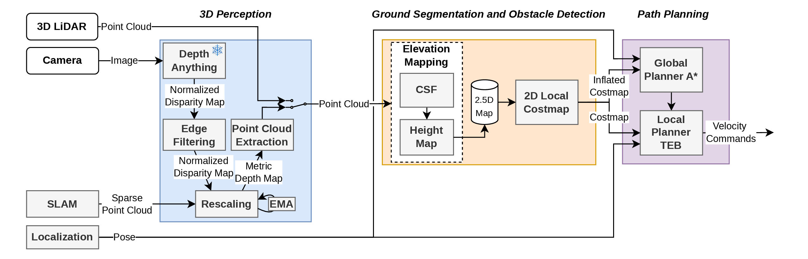
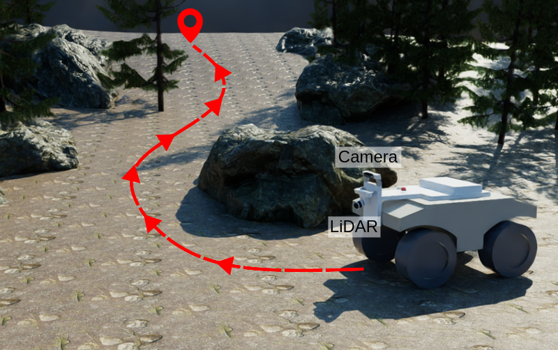
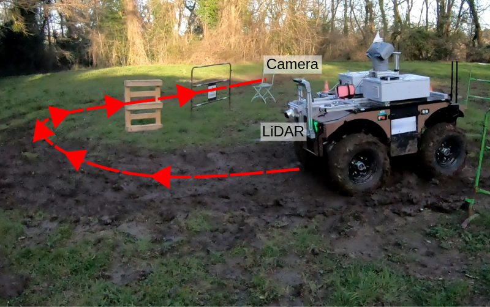
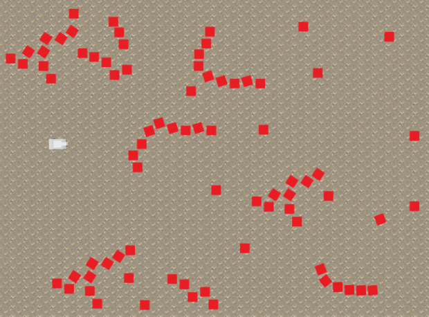
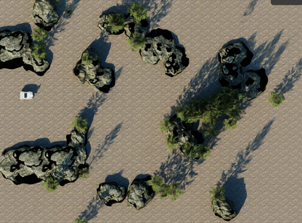
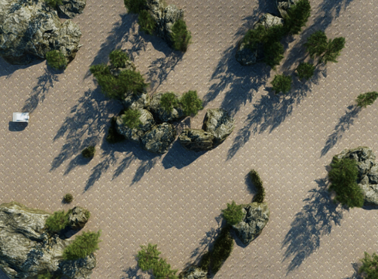

<div align="center">

# An Open-Source LiDAR and Monocular Off-Road Autonomous Navigation Stack

</div>

<p align="center">
  
</p>

<table align="center">
  <tr>
    <td align="center" width="49%">
      
      <br><em>Robot in simulation — main branch</em>
    </td>
    <td align="center" width="49%">
      
      <br><em>Robot in real scenario — barakuda branch</em>
    </td>
  </tr>
</table>

---

<p align="center">
  <a href="https://arxiv.org/abs/2604.03096"></a>
  &nbsp;
  <a href="https://lariad.github.io/Offroad-Nav/"></a>
</p>

If you use this work in your research, please cite:

```bibtex
@article{stacknav2026,
  title={An Open-Source LiDAR and Monocular Off-Road Autonomous Navigation Stack},
  author={Marsal, R{\'e}mi and Picard, Quentin and, Poir{\'e}, Adrien and Kerbourc'h, S{\'e}bastien and Toralba, Thibault and Chapoutot, Alexandre and Filliat, David},
  journal={arXiv preprint arXiv:2604.03096},
  year={2026}
}
```

## Overview

> [!WARNING]
> **ROS version:** This stack currently targets **ROS 1 (Noetic)**, **Isaac Sim 4.5.0** and **CUDA 11.6**.
> 
> CUDA 11.6 might be compatible with your GPU (see more details on
> [Nvidia's documentation](https://developer.nvidia.com/cuda/gpus)).
> 
> **A ROS 2 port is under active development**. Once available it will also unlock support for newer Isaac Sim 
> versions (which dropped the ROS 1 bridge) and newer CUDA versions.

This repository provides an autonomous off-road navigation stack for a UGV (Barakuda) running with **ROS 1 Noetic**. It is organized into two branches:

| Branch | Purpose |
|--------|---------|
| **`main`** | Simulation — runs in **NVIDIA Isaac Sim 4.5.0** with simulated sensors and environments |
| **`barakuda`** | Real robot — integration on the physical Barakuda UGV with real sensors (**not yet available**) |

The stack supports two sensor configurations:

| Mode | Sensors | Description |
|------|---------|-------------|
| **lidar** | Ouster OS0 + middle camera | LiDAR-based elevation mapping |
| **mono** | Middle camera only | Monocular depth estimation (Depth Anything V2) + elevation mapping |

The navigation pipeline:
1. **Isaac Sim** (simulation) or **real sensors** (barakuda branch) — publish sensor data via ROS
2. **elevation_mapping_cupy** — builds a 2.5D elevation map from point clouds
3. **move_base + TEB planner** — plans and executes obstacle-avoiding paths

---

## Repository Structure

```
Offroad-Nav/
├── assets/                  # USD environment stages (easy, medium, hard)
├── docker/                  # Dockerfiles and docker-compose for containerized runs
├── figs/                    # Images for documentation
├── isaac/                   # Isaac Sim installation directory (populated by install script)
├── mono_depth/              # Monocular depth estimation workspace (ROS Noetic)
├── nav_stack/               # Navigation stack workspace (ROS Noetic catkin)
├── scripts/                 # Launch and utility scripts
│   ├── launch_nav.sh        # Main launch script (headless or GUI)
│   ├── run_isaacenv.py      # Isaac Sim Python runner
│   ├── install_isaac.sh     # Isaac Sim setup and extension install
│   └── generate_dome_lidar.py
└── terrain.generator/       # Isaac Sim extension for procedural terrain
```

---

## Prerequisites

- **Ubuntu 20.04** (Focal Fossa)
- **NVIDIA GPU** with driver >= 525 and CUDA 11.6+
- **NVIDIA Isaac Sim 4.5.0** ([download page](https://docs.isaacsim.omniverse.nvidia.com/4.5.0/installation/download.html))
- **ROS Noetic** ([install guide](http://wiki.ros.org/noetic/Installation/Ubuntu))
- **Docker** + **nvidia-container-toolkit** (for containerized runs)

### Tested Hardware

In simulation, this stack has been tested with the following configuration:

| Component | Spec |
|-----------|------|
| **CPU** | Intel Xeon w5-3425 |
| **RAM** | 125 GB |
| **GPU** | NVIDIA RTX 5000 Ada Generation |
| **VRAM** | 32 GB |

---

## Installation

### 1. Clone the repository

```bash
git clone --recursive https://github.com/LARIAD/Offroad-Nav.git
cd Offroad-Nav
```

### 2. Install Isaac Sim 4.5.0

Download the **Isaac Sim 4.5.0 standalone** ZIP for Linux from the [NVIDIA download page](https://docs.isaacsim.omniverse.nvidia.com/4.5.0/installation/download.html).

Extract it into the `isaac/` directory:

```bash
mkdir isaac
unzip isaac-sim-standalone-4.5.0*.zip -d isaac/
```

then follow the [workstation installation guide](https://docs.isaacsim.omniverse.nvidia.com/4.5.0/installation/install_workstation.html).

### 3. Run the install script

This links the terrain generator extension and generates the dome lidar configuration:

```bash
ISAAC_DIR=./isaac/ ./scripts/install_isaac.sh
```

### 4. Build the docker image (and go take a coffee... or three)

```bash
cd docker/
docker build -t nav_stack:latest -f Dockerfile.navstack ..
```

See [docker/README.md](docker/README.md) for full instructions.

### 5. Build the nav stack and the monocular depth estimation workspace

Start the container `./docker_run.sh`, it will open the bash inside the container. Then execute the following commands:

```bash
source /opt/ros/noetic/setup.bash
cd nav_stack
catkin build
source devel/setup.bash
```
```bash
source /opt/ros/noetic/setup.bash
cd mono_depth
catkin build
source devel/setup.bash
```

---

## Usage

### Quick Start — Launch the Navigation Stack

The `launch_nav.sh` script starts the full pipeline: roscore, Isaac Sim, and the navigation stack via `barakuda_bringup`.

**GUI mode** (with Isaac Sim viewport):

```bash
./scripts/launch_nav.sh --stage /workspace/Offroad-Nav/assets/easy.usd --sensor lidar --config lidarreal --goal '{ header: { seq: 0, stamp: {secs: 0, nsecs: 0}, frame_id: "" }, goal_id: { stamp: {secs: 0, nsecs: 0}, id: "" }, goal: { target_pose: { header: { seq: 0, stamp: {secs: 0, nsecs: 0}, frame_id: "map" }, pose: { position: {x: 20.48, y: 13.22, z: 0.0}, orientation: {x: 0.0, y: 0.0, z: 0.0, w: 1.0} } }, controller: "TebLocalPlannerROS", planner: "GlobalPlanner", recovery_behaviors: [""] } }' --rviz
```

**Headless mode** (no GUI — e.g. remote server, CI):

```bash
./scripts/launch_nav.sh --stage /workspace/Offroad-Nav/assets/easy.usd --headless --sensor lidar --config lidarreal
```

**With RViz visualization:**

```bash
./scripts/launch_nav.sh --stage /workspace/Offroad-Nav/assets/medium.usd --sensor lidar --config lidarreal --rviz
```

#### Full Options

```
Usage: launch_nav.sh --stage <USD_FILE> [OPTIONS]

Required:
  --stage, -s <path>        Path to the USD stage file (e.g. /workspace/Offroad-Nav/assets/easy.usd)

Options:
  --headless                Run Isaac Sim without GUI (default: GUI mode)
  --sensor <type>           Sensor type: lidar, lidar_real, or mono (default: lidar)
  --config <type>           Config for navigation: lidarsim, lidarreal, monovins (default: lidarreal)
  --rviz                    Launch RViz for visualization
  --port <port>             ROS master port (default: 11311)
  --goal <yaml>             Send a navigation goal (geometry_msgs/PoseStamped YAML)
  --timeout <minutes>       Timeout in minutes (default: 0 = unlimited)
```

### Available Environments

| Stage | File | Description |
|-------|------|-------------|
| Easy | `assets/easy.usd` | Flat terrain with red cubes |
| Medium | `assets/medium.usd` | Photorealistic obstacles, trees and rocks, instead of the red cubes |
| Hard | `assets/hard.usd` | Same assets as medium, with ground elevation and high grass as traversable obstacles |

<table align="center">
  <tr>
    <td align="center" width="33%">
      
      <br><em>Easy</em>
    </td>
    <td align="center" width="33%">
      
      <br><em>Medium</em>
    </td>
    <td align="center" width="33%">
      
      <br><em>Hard</em>
    </td>
  </tr>
</table>

### Manual Launch (step by step)

```bash
# Terminal 1 — roscore
source nav_stack/devel/setup.bash
roscore

# Terminal 2 — Isaac Sim (GUI)
./isaac/python.sh scripts/run_isaacenv.py --stage /workspace/Offroad-Nav/assets/easy.usd --sensor lidar --gui

# Terminal 3 — Navigation stack (lidar config)
source nav_stack/devel/setup.bash
roslaunch barakuda_bringup lidar_real_params.launch
# For real lidar params: roslaunch barakuda_bringup lidar_real_params.launch
# For monocular config:  roslaunch barakuda_bringup mono_vins.launch

# Terminal 4 (optional) — RViz
rviz -d /workspace/Offroad-Nav/scripts/rviz_config.rviz

# Terminal 5 (optional) — Send a navigation goal
# Final point ~10 m
rostopic pub /move_base_flex/move_base/goal mbf_msgs/MoveBaseActionGoal '{ header: { seq: 0, stamp: {secs: 0, nsecs: 0}, frame_id: "" }, goal_id: { stamp: {secs: 0, nsecs: 0}, id: "" }, goal: { target_pose: { header: { seq: 0, stamp: {secs: 0, nsecs: 0}, frame_id: "map" }, pose: { position: {x: 10.73, y: -6.22, z: 0.0}, orientation: {x: 0.0, y: 0.0, z: 0.0, w: 1.0} } }, controller: "TebLocalPlannerROS", planner: "GlobalPlanner", recovery_behaviors: [""] } }' --once

# Final point ~20 m
rostopic pub /move_base_flex/move_base/goal mbf_msgs/MoveBaseActionGoal '{ header: { seq: 0, stamp: {secs: 0, nsecs: 0}, frame_id: "" }, goal_id: { stamp: {secs: 0, nsecs: 0}, id: "" }, goal: { target_pose: { header: { seq: 0, stamp: {secs: 0, nsecs: 0}, frame_id: "map" }, pose: { position: {x: 20.48, y: 13.22, z: 0.0}, orientation: {x: 0.0, y: 0.0, z: 0.0, w: 1.0} } }, controller: "TebLocalPlannerROS", planner: "GlobalPlanner", recovery_behaviors: [""] } }' --once

# Final point ~30 m
rostopic pub /move_base_flex/move_base/goal mbf_msgs/MoveBaseActionGoal '{ header: { seq: 0, stamp: {secs: 0, nsecs: 0}, frame_id: "" }, goal_id: { stamp: {secs: 0, nsecs: 0}, id: "" }, goal: { target_pose: { header: { seq: 0, stamp: {secs: 0, nsecs: 0}, frame_id: "map" }, pose: { position: {x: 30.95, y: -13.47, z: 0.0}, orientation: {x: 0.0, y: 0.0, z: 0.0, w: 1.0} } }, controller: "TebLocalPlannerROS", planner: "GlobalPlanner", recovery_behaviors: [""] } }' --once
```

### Teleop (manual control)

```bash
# In the container or a new terminal:
rostopic pub /cmd_vel geometry_msgs/Twist "linear: {x: 0.5}" -r 10
# Or use teleop_twist_keyboard:
rosrun teleop_twist_keyboard teleop_twist_keyboard
```

---

## Sensor Topics

| Topic | Type | Description |
|-------|------|-------------|
| `/ouster/points` | `sensor_msgs/PointCloud2` | LiDAR point cloud |
| `/cam0/image_raw` | `sensor_msgs/Image` | Left camera |
| `/cam1/image_raw` | `sensor_msgs/Image` | Right camera |
| `/cam2/image_raw` | `sensor_msgs/Image` | Middle camera |
| `/imu/odometry` | `nav_msgs/Odometry` | Robot odometry |
| `/clock` | `rosgraph_msgs/Clock` | Simulation clock |
| `/cmd_vel` | `geometry_msgs/Twist` | Velocity commands |
| `/move_base_simple/goal` | `geometry_msgs/PoseStamped` | Navigation goal |

---

## Project Documentation

| Component | README |
|-----------|--------|
| Navigation stack (ROS packages) | [nav_stack/README.md](nav_stack/README.md) |
| Docker setup | [docker/README.md](docker/README.md) |
| Scripts | [scripts/README.md](scripts/README.md) |
| Terrain generator extension | [terrain.generator/README.md](terrain.generator/README.md) |
| Monocular depth estimation | [mono_depth/README.md](mono_depth/README.md) |

---

## Acknowledgments

This stack builds on several open-source components released by the community:

- **[NVIDIA Isaac Sim](https://developer.nvidia.com/isaac-sim)** — robotics simulation platform used for the simulated environments and sensors.
- **[Nvidia-Isaac-Sim-Procedual-Forest-Generator](https://github.com/joevento/Nvidia-Isaac-Sim-Procedual-Forest-Generator)** (Joel Ventola, University of Oulu) — upstream of the [terrain.generator/](terrain.generator/) Isaac Sim extension.
- **[elevation_mapping_cupy](https://github.com/leggedrobotics/elevation_mapping_cupy)** (Legged Robotics, ETH Zürich) — GPU-accelerated 2.5D elevation mapping.
- **[move_base_flex](https://github.com/magazino/move_base_flex)** — flexible navigation framework used through `mbf_gridmap`.
- **[Depth Anything V2](https://github.com/DepthAnything/Depth-Anything-V2)** — monocular depth foundation model used in the `mono` sensor pipeline.
- **[Depth rescaling](https://github.com/ENSTA-U2IS-AI/depth-rescaling)** — scale-recovery method integrated in [mono_depth/src/depth_rescaling/](mono_depth/).

---

## License

This project is licensed under the [MIT License](LICENSE).
