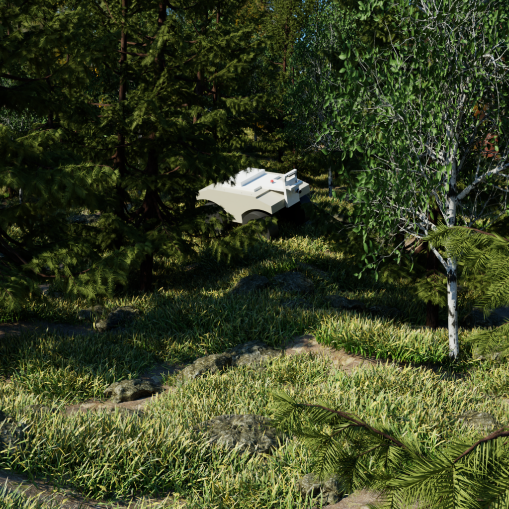

# 🌲 Terrain Generation Extension for NVIDIA Isaac Sim

This extension adds terrain and environment generation tools to [NVIDIA Isaac Sim](https://developer.nvidia.com/isaac-sim), enabling realistic and dynamic scene creation for robotics simulation.

Built on [USD (Universal Scene Description)](https://openusd.org/), it is designed to handle large-scale virtual environments efficiently, with a focus on replicating natural forest terrain based on real-world data.

---

## 📸 Preview



---

## ✨ Features

- **🌍 Terrain Generation**  
  Generate terrain from parameters like roughness, size, and terrain type.

- **🌳 Forest Rendering**  
  Populate terrain with birch, spruce, pine, and more — control tree type, density, and age range.

- **💡 HDR Environment Support**  
  Easily toggle realistic HDR lighting for your simulation scenes.

- **🪨 Rocks & Vegetation**  
  Add procedurally generated rocks and other flora with adjustable density and randomness.

- **🧱 Automatic Collisions**  
  Terrain includes preconfigured collision properties for physics-based simulation.

- **🖱️ Intuitive UI Panel**  
  Modify parameters and trigger generation directly from Isaac Sim’s window system.

---

## 🛠️ Installation

This extension is **automatically installed** when using the main [`install_isaac.sh`](../scripts/install_isaac.sh) setup script in this repository.  
No manual setup is required if you follow that process.

---

## 🚀 Usage

1. Launch Isaac Sim and navigate to: ```Window → Terrain Generator```
2. Set the desired parameters for terrain, vegetation, rocks, etc.
3. Click **Generate** to create the scene.
4. Save your world and simulation as usual.

---

## 🧑‍🔬 Research Background

This extension was initially developed by **Joel Ventola** at the **University of Oulu** (Biomimetics and Intelligent Systems Group) for simulation-based evaluation of mobile robots in natural environments — see the original repository: [joevento/Nvidia-Isaac-Sim-Procedual-Forest-Generator](https://github.com/joevento/Nvidia-Isaac-Sim-Procedual-Forest-Generator).

It was later significantly **refactored and extended** by **Eddie Groh** as part of robotics research at the **U2IS Lab, ENSTA Paris**.

---

## 📄 License

This extension is licensed under the [MIT License](LICENSE).